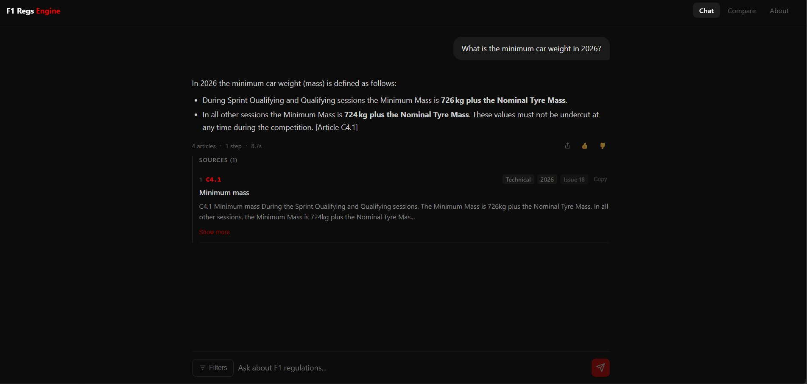

# F1 Regulations Engine

**AI-powered search across FIA Formula 1 regulations**


Ask questions about Formula 1 regulations in plain language and receive precise, citation-backed answers sourced directly from official FIA documents. Every response references the exact article it draws from — no hallucinations, no guessing.

Live demo: [f1-regulations-engine-project.vercel.app](https://f1-regulations-engine-project.vercel.app)

---



---

## Features

- **Hybrid search** — Combines vector similarity (pgvector) and full-text search (PostgreSQL), merged with Reciprocal Rank Fusion (RRF) for best-of-both recall and precision.
- **Agentic research loop** — Up to three search-reason cycles, following cross-references between articles before committing to an answer.
- **Mandatory citations** — Every answer includes exact article codes, section, year, and issue. No answer is returned without a verifiable source.
- **Local embeddings** — `all-MiniLM-L6-v2` runs on the backend; no third-party embedding API is called.
- **Multi-year coverage** — Technical, Sporting, and Financial regulations for 2023 through 2026 (16,000+ articles indexed).
- **Multilingual queries** — Accepts questions in English, Spanish, French, German, and Italian.
- **Feedback loop** — Thumbs up/down on each answer feeds a `query_logs` table for ongoing quality monitoring.

---

## Architecture

```
Browser
  |
  | HTTP
  v
Next.js 14  (Vercel)
  - Chat interface with citation cards
  - Year / section / issue filters
  |
  | REST
  v
FastAPI  (Render)
  |
  |-- detect_intent()        local regex classifier, zero LLM calls
  |-- prepare_search()       1 LLM call: extract year + section + rewritten query
  |
  `-- Agentic loop (max 3 steps)
        |
        |-- HybridRetriever
        |     |- embed query         all-MiniLM-L6-v2, 384 dims, local
        |     |- vector search       pgvector cosine distance (threshold 0.75)
        |     |- full-text search    PostgreSQL tsvector / tsquery
        |     `- merge               Reciprocal Rank Fusion (k=60)
        |
        `-- generate_reasoning_step()   LLM: SEARCH | ANSWER
              `-- if ANSWER --> return response + citations
  |
  | asyncpg
  v
PostgreSQL + pgvector  (Supabase)
  - documents            PDF metadata
  - articles             extracted articles with year / section / issue
  - article_embeddings   384-dim vectors (one per article)
  - query_logs           request history and feedback
```

---

## Quick Start

Requires Docker and Docker Compose, plus an [OpenRouter](https://openrouter.ai) API key.

```bash
# Clone
git clone https://github.com/alvaroherrera-33/f1-regulations-engine.git
cd f1-regulations-engine

# Configure
cp .env.example .env
# Edit .env and set OPENROUTER_API_KEY

# Start all services (db + backend + frontend)
docker-compose up --build

# Ingest the regulation PDFs
docker-compose exec backend python -m scripts.ingest_archives

# Open
#   Frontend:  http://localhost:3000
#   API docs:  http://localhost:8000/docs
```

See [docs/QUICKSTART.md](docs/QUICKSTART.md) for detailed setup and [docs/DEPLOYMENT.md](docs/DEPLOYMENT.md) for production deployment to Render + Supabase + Vercel.

---

## Tech Stack

| Layer | Technology | Notes |
|-------|-----------|-------|
| Backend | FastAPI (Python 3.11) | Async, uvicorn |
| Frontend | Next.js 14 (TypeScript) | App router, inline styles |
| Database | PostgreSQL + pgvector | 384-dim vectors, hybrid search |
| Embeddings | all-MiniLM-L6-v2 | Runs locally on backend, no external API |
| LLM | OpenRouter API | Model configurable via `LLM_MODEL` env var |
| Backend hosting | Render (free tier) | |
| Frontend hosting | Vercel | |
| Database hosting | Supabase | Session Pooler for IPv4 compatibility |
| Local dev | Docker Compose | Three services: db, backend, frontend |

---

## API Endpoints

| Method | Endpoint | Description |
|--------|----------|-------------|
| GET | `/health` | Database connectivity check |
| GET | `/status` | Article and embedding counts |
| GET | `/warmup` | Pre-load embedding model (cron keep-alive) |
| POST | `/api/chat` | Main RAG query — returns answer, citations, query_id |
| POST | `/api/chat/feedback` | Submit thumbs up/down for a query_id |
| GET | `/api/stats` | Aggregated quality metrics from query_logs |
| GET | `/api/articles` | List articles with optional filters |
| GET | `/api/articles/{code}` | Article by code |
| POST | `/api/upload` | Upload a PDF and trigger ingestion |
| GET | `/docs` | Swagger UI |

### Example request

```bash
curl -X POST https://f1-regulations-engine.onrender.com/api/chat \
  -H "Content-Type: application/json" \
  -d '{"query": "What is the minimum car weight in 2026?", "year": 2026, "section": "Technical"}'
```

```json
{
  "answer": "In 2026 the minimum car weight (mass) is defined as follows: During Sprint Qualifying and Qualifying sessions the Minimum Mass is **726 kg plus the Nominal Tyre Mass**. In all other sessions the Minimum Mass is **724 kg plus the Nominal Tyre Mass**. [Article C4.1]",
  "citations": [
    {
      "article_code": "C4.1",
      "title": "Minimum mass",
      "excerpt": "C4.1 Minimum mass During the Sprint Qualifying and Qualifying sessions, the Minimum Mass is 726kg plus the Nominal Tyre Mass...",
      "year": 2026,
      "section": "Technical",
      "issue": 18
    }
  ],
  "retrieved_count": 4,
  "query_id": 1042
}
```

---

## Environment Variables

| Variable | Required | Description |
|----------|----------|-------------|
| `OPENROUTER_API_KEY` | Yes | OpenRouter API key |
| `DATABASE_URL` | Yes | Async PostgreSQL URL (`postgresql+asyncpg://...`) |
| `LLM_MODEL` | No | Model via OpenRouter (default: `openai/gpt-oss-120b`) |
| `ALLOWED_ORIGINS` | No | CORS origins, comma-separated (default: `http://localhost:3000`) |

---

## License

MIT. Built by [Álvaro Herrera](https://github.com/alvaroherrera-33).
